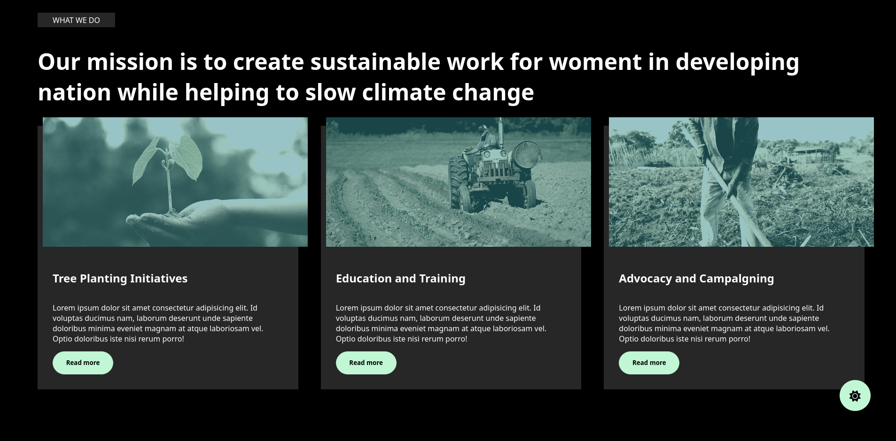

# Styling

## Features To Watch

    
Dark/Light Theme

     
    

      
    

    <pre>
const setLightTheme = () => {
    rootStyles.style.setProperty('--primary-text-color', 'var(--black-light-theme-color)');
    rootStyles.style.setProperty('--secondary-text-color', 'var(--blue-light-theme-color)');
    rootStyles.style.setProperty('--tertiary-text-color', 'var(--white-light-theme-color)');
    rootStyles.style.setProperty('--primary-body-color', 'var(--white-light-theme-color)');
    rootStyles.style.setProperty('--secondary-body-color', 'var(--blue-light-theme-color)');
    rootStyles.style.setProperty('--tertiary-body-color', 'var(--blue-light-theme-color)');
}
const setDarkTheme = () => {
    rootStyles.style.setProperty('--primary-text-color', 'var(--white-dark-theme-color)');
    rootStyles.style.setProperty('--secondary-text-color', 'var(--l-grey-dark-theme-color)');
    rootStyles.style.setProperty('--tertiary-text-color', 'var(--grey-dark-theme-color)');
    rootStyles.style.setProperty('--primary-body-color', 'var(--black-dark-theme-color)');
    rootStyles.style.setProperty('--secondary-body-color', 'var(--grey-dark-theme-color)');
    rootStyles.style.setProperty('--tertiary-body-color', 'var(--black-dark-theme-color)');
}
    </pre>

    
Reusable code

     
    

      
    

    <pre>
.green {
    position: relative;
    object-fit: cover;
    width: 100%;
}
.green::after {
    content: "";
    position: absolute;
    opacity: 0.50;
    inset: 0;
    filter: brightness(80%);
    background: #40acb4;
}
.green img {
    filter: grayscale(80%) sepia(40%) contrast(1.22);
}
    </pre>

## Final Solution

<pre>
project/
|-- css/
|   |-- main.css
|   |-- base/
|       |-- index.css
|   |-- layout/
|       |-- index.css
|       |-- _header.css
|       |-- _footer.css
|   |-- components/
|       |-- index.css
|       |-- _navbar.css
|       |-- _buttons.css
|   |-- theme/
|       |-- index.css
</pre>
<ol>
    <li>
        In base directory, each file should follow SMACSS rules, as styles will be applied directly to HTML elements without using any class or ID selectors.
    </li>
    <li>
        Layout directory must follow BEM rules.
    </li>
    <li>
        Components directory is the integration point between SMACSS and BEM as in SMACSS it is divided into two directories which are 'Moudule' and 'state', but here in this project we will combine all of these in one directory that will follow BEM rules.
    </li>
    <li>
        Theme directory should contain theme variables.
    </li>
</ol>

    
Class naming convention

    

        Creative solution inspired from BEM (Block Element Modifier) and SMACSS (Scalable and Modular Architecture for CSS) styling methodologies
    

    
File structure

    

        There is not a strict folder structure that should be used to implement these methodologies, but a creative solution is also made here (which is mentioned in "Final Solution" toggle list).
    

## Good to Know

    
What is a styling methodology?

    A CSS (Cascading Style Sheets) styling methodology is a systematic approach or set of guidelines that developers follow to organize and structure their CSS code. The goal of a styling methodology is to create maintainable, scalable, and efficient stylesheets for web development.

    
What is BEM styling methdology?

    <ul>
      <li>
        Block: Represents a standalone component that is reusable and meaningful on its own (e.g., header, menu).
      </li>
      <li>
        Element: Represents a part of a block and cannot be used outside of it (e.g., button within a header).
      </li>
      <li>
        Modifier: Represents a variation or state of a block or element (e.g., a disabled button).
      </li>
       
      
Code Example:

       
      <pre>
        // CSS Styles
        .block {
        }
        .block--modifier {
        }
        .block__element {
        }
        .block__element--modifier {
        }
      </pre>
      <pre>
        // HTML
        &lt;div class="block block--modifier"&gt;
          &lt;span class="block__element block__element--modifier"&gt;&lt;/span&gt;
        &lt;/div&gt;
      </pre>
    </ul>

    
What is SMACSS styling methdology?

    <ul>
      <li>
        Categorizes styles into five types: Base, Layout, Module, State, and Theme.
      </li>
      <li>
        The Base category defines the default styling for HTML elements. It includes things like reset styles and common styling for basic elements like headings, paragraphs, and links.
        
Example:

        <pre>
/* Base styles */
body {
  margin: 0;
  padding: 0;
}
h1,
h2,
h3 {
  font-weight: normal;
}
a {
  color: #0066cc;
}
</pre>
      </li>
      <li>
        The Layout category deals with the major structural components of the layout. It includes styles for defining the overall layout structure, such as header, footer, main content area, and sidebars.
        
Example:

        <pre>
/* Layout styles */
.header {
  background-color: #333;
  color: #fff;
}
.main-content {
  width: 70%;
  float: left;
}
.sidebar {
  width: 30%;
  float: left;
}
        </pre>
      </li>
      <li>
        The Module category encapsulates reusable, modular components or widgets. These are the building blocks of your interface.
        
Example:

        <pre>
/* Module styles */
.button {
  display: inline-block;
  padding: 10px 20px;
  background-color: #0066cc;
  color: #fff;
  text-decoration: none;
  border-radius: 4px;
}
.alert {
  padding: 10px;
  border: 1px solid #c00;
  background-color: #fdd;
  color: #c00;
}
        </pre>
      </li>
      <li>
        The State category deals with styles that define how modules or layouts look in a particular state. This can include styles for a module when it's in a hover state, active state, or any other dynamic state.
        
Example:

        <pre>
/* State styles */
.button:hover {
  background-color: #004080;
}

.alert.success {
border-color: #4caf50;
background-color: #d4edda;
color: #155724;
}

</pre>
</li>
<li>
The Theme category contains styles related to the visual styling of the application or website. It allows for easy theming by changing a few base styles to create a different look and feel.

Example:

<pre>
/_ Theme styles _/
.theme-dark .header {
background-color: #000;
color: #fff;
}

.theme-light .header {
background-color: #fff;
color: #000;
}

</pre>
</li>
</ul>

 

[Back To Top](#styling)

[Back To Readme](../README.md)
